# Appendix: inter-service-communication

> Staged 2026-07-24. Not yet merged into architecture.md.
> Sources: gateway source (verified locally), accounting `external/README.md`,
> ledger `docs/topics/goledger.md`, gopzevents/gopzdata READMEs.

## Summary

Two kinds of communication coexist: **synchronous HTTP/REST calls** and
**asynchronous messaging** (Pub/Sub events, Cloud Tasks). The gateway is the
hub for synchronous traffic; the ledger event pipeline is the backbone of the
async side.

```mermaid
flowchart LR
    subgraph UIs
        frontend[frontend]
        admin[admin]
    end
    gw[gateway]
    pyledger[ledger &#40;Python&#41;]
    goledger[goledger]
    acct[accounting]
    events[gopzevents]
    data[gopzdata]

    frontend --> gw
    admin --> gw

    gw -->|REST: balances, journals, reports| pyledger
    gw -->|REST &#40;ID-token&#41;| goledger
    gw -->|REST| acct
    gw -.->|Pub/Sub: ledger events| pyledger
    pyledger -.->|Pub/Sub: acks| gw
    gw -.->|Pub/Sub: events &#40;custom-CoA&#41;| goledger

    acct -->|HTTP| pyledger
    acct -->|HTTP| gw
    acct -.->|read-only replica| gwdb[(gateway DB)]
    acct -.->|Pub/Sub: accrual events| pyledger

    pyledger -.->|Cloud Tasks queue| goledger
    goledger -->|HTTP: transform events| events
    events -->|HTTP: resolve CoA keys / accounts| data
    goledger -->|HTTP: sync companies| data
```

Solid arrows are synchronous calls; dashed arrows are async (Pub/Sub, Cloud
Tasks) or direct data access.

## Edge-by-edge

| From | To | Mechanism | Purpose / evidence |
|------|----|-----------|--------------------|
| gateway | ledger | REST | Balances, journals, reports — "most API requests from the Gateway" (`src/ledger/client.ts`) |
| gateway | goledger | REST | ID-token-authed Cloud Run calls (`src/ledger/goLedgerClient.ts`) |
| gateway | accounting | REST | Accrual operations (`src/accountingService/client.ts`) |
| gateway | ledger / goledger | Pub/Sub | Event-sourcing write path; acks return on the `LedgerEventAcks` topic. Custom-CoA companies' events are processed by goledger, the rest by the Python ledger |
| accounting | ledger | HTTP | `external/ledger_http` |
| accounting | gateway | HTTP | `external/gateway_http` |
| accounting | gateway DB | direct SQL | Read-only replica (`external/gateway_db`); documented as tech debt to be replaced by gateway endpoints |
| accounting | ledger | Pub/Sub | Publishes accrual events the ledger consumes |
| ledger | goledger | Cloud Tasks | Python ledger enqueues onto a dedicated `goledger_high_queue` |
| goledger | gopzevents | HTTP | Sends events for transformation into ledger journal events |
| gopzevents | gopzdata | HTTP | Resolves CoA keys, external accounts, automation accounts |
| goledger | gopzdata | HTTP | Syncs companies in ("one writer" for company mappings) |

## The Go-era event relay

For a custom-CoA company, one ledger event travels:
gateway → (Pub/Sub) → goledger → (HTTP) → gopzevents → (HTTP, lookups) →
gopzdata → journal event returned → goledger persists it to the ledger's
stores. The Events Service is intended to become the *only* transformer of
events into journal entries; the Python ledger still uses its own logic.

## Caveats

- Reverse directions (e.g., goledger → gateway) were not exhaustively swept;
  "no edge shown" means no evidence found, not proven absence.
- The "Ledger" in the gopzevents README's flow reads as the Go ledger for
  custom-CoA traffic; the Python ledger does not use the Events Service.
- frontend/admin call only the gateway (internal GraphQL); they are shown for
  context and are not part of the engine.
