# Puzzle Platform — Architecture

> **Status:** Draft · **Owner:** Bill DeStein · **Last updated:** 2026-07-24
>
> Sections merged so far: Services and Repositories · Inter-Service Communication · Databases.

---

## Table of Contents

<!-- Regenerated whenever a chapter is added or an appendix is merged. Most
     renderers (GitHub, VS Code, Pandoc with --toc) also auto-derive a TOC
     from the headings; this manual list doubles as the document outline. -->

1. [Overview](#overview)
2. [Services and Repositories](#services-and-repositories)
   1. [gateway](#gateway)
   2. [ledger](#ledger)
   3. [goledger](#goledger)
   4. [accounting](#accounting)
   5. [gopzevents](#gopzevents)
   6. [gopzdata](#gopzdata)
3. [Inter-Service Communication](#inter-service-communication)
   1. [Edge-by-Edge](#edge-by-edge)
4. [Databases](#databases)

---

## Overview

<!-- to be written -->

## Services and Repositories

The accounting engine spans six repositories:

| Repo | Language | Role in the engine |
|------|----------|--------------------|
| `gateway` | TypeScript | Ingests integration data, builds the financial graph, emits ledger events, serves the APIs |
| `ledger` | Python | The general ledger — append-only, bitemporal source of truth; owns the journal and chart of accounts |
| `goledger` | Go | Ledger performance sidecar — processes events for custom-CoA companies, payroll journal mappings, syncs to the data service |
| `accounting` | Python | Accrual computations — revenue schedules from invoice/subscription data |
| `gopzevents` | Go | Events service — the eventing backbone for the Go-era stack |
| `gopzdata` | Go | Data service — company data store that goledger syncs into |

### gateway

A TypeScript/Node.js monolith on GCP, deployed two ways from one codebase:
an API mode (App Engine) and a worker mode (Cloud Run). It ingests data from
integration sources (banks, payment processors, payroll providers),
normalizes it into the financial graph in its own PostgreSQL database,
categorizes transactions, and emits events to the ledger. It serves three
API surfaces: internal GraphQL for the web app, partner GraphQL, and the
external REST API, whose OpenAPI spec it generates from Zod contracts.

### ledger

The core accounting engine, in Python: the ledger journal (journal entries
originating from ledger events) and the chart of accounts. Designed to be
immutable (append-only), correctable, and bitemporal — the accounting source
of truth. It owns its own PostgreSQL schema, uses Bigtable for fast balance
access, and serves most ledger API requests from the gateway, including
financial reporting and ledger account creation.

### goledger

A Go reimplementation of ledger functionality, built for speed and
concurrency and ultimately intended to replace the Python ledger. Today it
exclusively processes events for companies with a custom chart of accounts
(BYOCOA), generates payroll journal mappings, and syncs companies to the
Data Service. It owns no schema of its own, riding on the ledger's
PostgreSQL and Bigtable stores.

### accounting

The Accounting Service, in Python, handles accrual-related work — for
example, building schedules of recurring revenue events from invoice and
subscription data. It owns its own PostgreSQL schema and publishes events
the ledger consumes. It calls the ledger and gateway over HTTP, and also
reads the gateway's database directly via a read-only replica — an access
path intended to be replaced by dedicated gateway endpoints.

### gopzevents

The Puzzle Events Service builds and validates events and transforms them
into ledger journal events. In the Go-ledger flow, the ledger forwards
events here; the Events Service resolves CoA keys and accounts (consulting
the Data Service as needed), applies its accounting logic, and returns a
journal event the ledger can persist without further interpretation. It is
intended to become the only service that transforms events into journal
entries; today the Python ledger still uses its own logic.

### gopzdata

The Puzzle Data Service makes selected data from one service available to
all others — a "one writer, many readers" model where each mapping type has
a single owning writer and any service may read. Mappings are backed by
Bigtable for fast access. It is explicitly not primary storage: owners keep
their data in their own databases and sync it promptly. goledger syncs
companies in; the Events Service reads CoA-key and account mappings out.

## Inter-Service Communication

Two kinds of communication coexist: **synchronous HTTP/REST calls** and
**asynchronous messaging** (Pub/Sub events, Cloud Tasks). The gateway is the
hub for synchronous traffic; the ledger event pipeline is the backbone of the
async side.

```mermaid
flowchart LR
    subgraph UIs
        frontend[frontend]
        admin[admin]
    end
    gw[gateway]
    pyledger[ledger &#40;Python&#41;]
    goledger[goledger]
    acct[accounting]
    events[gopzevents]
    data[gopzdata]

    frontend --> gw
    admin --> gw

    gw -->|REST: balances, journals, reports| pyledger
    gw -->|REST &#40;ID-token&#41;| goledger
    gw -->|REST| acct
    gw -.->|Pub/Sub: ledger events| pyledger
    pyledger -.->|Pub/Sub: acks| gw
    gw -.->|Pub/Sub: events &#40;custom-CoA&#41;| goledger

    acct -->|HTTP| pyledger
    acct -->|HTTP| gw
    acct -.->|read-only replica| gwdb[(gateway DB)]
    acct -.->|Pub/Sub: accrual events| pyledger

    pyledger -.->|Cloud Tasks queue| goledger
    goledger -->|HTTP: transform events| events
    events -->|HTTP: resolve CoA keys / accounts| data
    goledger -->|HTTP: sync companies| data
```

Solid arrows are synchronous calls; dashed arrows are async (Pub/Sub, Cloud
Tasks) or direct data access. The frontend and admin UIs call only the
gateway and are shown for context.

### Edge-by-Edge

| From | To | Mechanism | Purpose / evidence |
|------|----|-----------|--------------------|
| gateway | ledger | REST | Balances, journals, reports — "most API requests from the Gateway" (`src/ledger/client.ts`) |
| gateway | goledger | REST | ID-token-authed Cloud Run calls (`src/ledger/goLedgerClient.ts`) |
| gateway | accounting | REST | Accrual operations (`src/accountingService/client.ts`) |
| gateway | ledger / goledger | Pub/Sub | Event-sourcing write path; acks return on the `LedgerEventAcks` topic. Custom-CoA companies' events are processed by goledger, the rest by the Python ledger |
| accounting | ledger | HTTP | `external/ledger_http` |
| accounting | gateway | HTTP | `external/gateway_http` |
| accounting | gateway DB | direct SQL | Read-only replica (`external/gateway_db`); documented as tech debt to be replaced by gateway endpoints |
| accounting | ledger | Pub/Sub | Publishes accrual events the ledger consumes |
| ledger | goledger | Cloud Tasks | Python ledger enqueues onto a dedicated `goledger_high_queue` |
| goledger | gopzevents | HTTP | Sends events for transformation into ledger journal events |
| gopzevents | gopzdata | HTTP | Resolves CoA keys, external accounts, automation accounts |
| goledger | gopzdata | HTTP | Syncs companies in ("one writer" for company mappings) |

## Databases

Four primary stores plus two shared caching layers. The rule is one
PostgreSQL database per service, with the owning service holding the schema
and its migrations; services otherwise integrate through APIs and events,
never each other's tables.

```mermaid
flowchart TB
    gw[gateway]
    pyledger[ledger &#40;Python&#41;]
    goledger[goledger]
    acct[accounting]
    data[gopzdata]

    gwpg[(Gateway Postgres)]
    ledgerpg[(Ledger Postgres)]
    acctpg[(Accounting Postgres)]
    bt[(Bigtable)]
    redis[(Redis)]

    gw --> gwpg
    acct -.->|read-only replica| gwpg
    pyledger --> ledgerpg
    goledger -->|no schema of its own| ledgerpg
    acct --> acctpg
    pyledger --> bt
    goledger --> bt
    data -->|mappings: one writer, many readers| bt
    gw -.->|sqcache reads| bt
    gw -.-> redis
```

Solid arrows are owning or writing relationships; dashed arrows are
read-only or cache access.

| Store | Owner (schema + writes) | Also accessed by | Contents |
|-------|------------------------|------------------|----------|
| Gateway Postgres (CloudSQL) | `gateway` (TypeORM) | `accounting` — direct read-only replica access | The financial graph: companies, users, integrations, accounts, transactions, bills, invoices |
| Ledger Postgres | `ledger` (Alembic; bitemporality via the `temporal_tables_puzzle` fork) | `goledger` — reads and writes via `pgx`, owns no schema | The books: journal entries, chart of accounts — append-only source of truth |
| Accounting Postgres | `accounting` (Alembic) | — | Accrual schedules, recurring revenue events |
| Bigtable | Split by table: ledger balance data (`ledger`/`goledger`); mapping tables (`gopzdata`) | `gateway` reads ledger-managed cache entries (`sqcache`); `gopzevents` reads mappings via the data service | Fast-access balances; cross-service shared mappings |
| Redis | n/a — cache, not a system of record | `gateway` (sessions, rate limiting, caching); distributed locks (`redishilok`) | Ephemeral cache |
