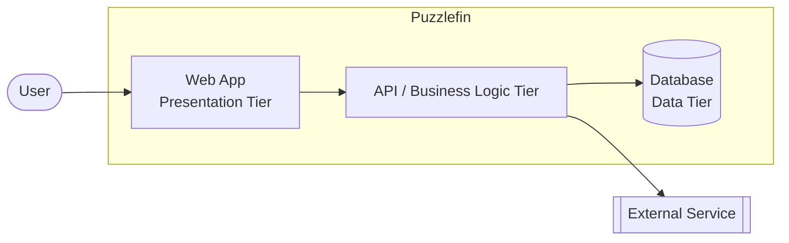
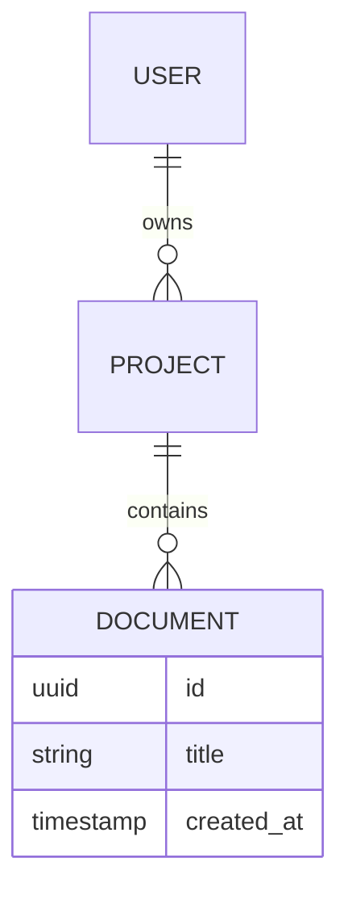
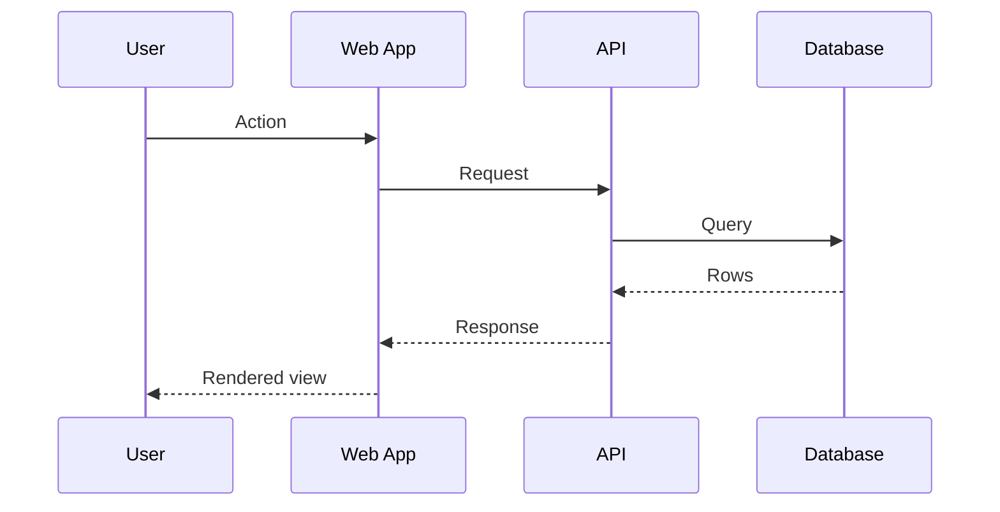
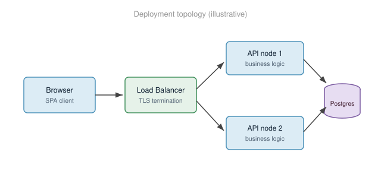

# Puzzlefin — System Design Document

> **Status:** Draft · **Owner:** Bill · **Last updated:** 2026-07-10
>
> This is a starter template. Replace the bracketed placeholders and delete
> guidance blockquotes as you go.

---

## Table of Contents

<!-- Most renderers (GitHub, VS Code, Obsidian, Pandoc with --toc) can
     auto-generate this from the headings below. The manual list here is a
     fallback and a quick outline of the document. -->

1. [Overview](#overview)
2. [Goals and Non-Goals](#goals-and-non-goals)
3. [Architecture](#architecture)
   1. [System Context](#system-context)
   2. [Component View](#component-view)
4. [Data Model](#data-model)
5. [Key Flows](#key-flows)
   1. [Request Lifecycle](#request-lifecycle)
6. [API Design](#api-design)
7. [Deployment](#deployment)
8. [Cross-Cutting Concerns](#cross-cutting-concerns)
9. [Alternatives Considered](#alternatives-considered)
10. [Open Questions](#open-questions)
11. [References](#references)

---

## Overview

[One or two paragraphs: what is this system, who uses it, and why does it
exist. Write this so a new engineer can understand the problem in 60 seconds.]

## Goals and Non-Goals

**Goals**

- [Goal 1 — what the system must do]
- [Goal 2]
- [Goal 3]

**Non-Goals**

- [Explicitly out of scope — this prevents scope creep and sets expectations]
- [Non-goal 2]

## Architecture

### System Context

How the system sits relative to users and external systems (a C4 "context"
diagram). This is a Mermaid diagram — it lives as text right here in the doc.

### Component View

[Describe the major components and their responsibilities. One short
paragraph per component, or a table.]

| Component | Responsibility | Tech |
|-----------|----------------|------|
| Web App | Presentation, client-side state | [e.g. React] |
| API | Business logic, auth, orchestration | [e.g. Node/GraphQL] |
| Database | Persistence | [e.g. Postgres] |

## Data Model

Entities and their relationships (an ER diagram, also Mermaid text):

## Key Flows

### Request Lifecycle

A sequence diagram showing how a typical request moves through the tiers:

## API Design

[Endpoints or GraphQL schema, request/response shapes, error semantics,
versioning strategy.]

## Deployment

[Environments, topology, scaling. For a freeform infra picture, draw it in
draw.io and export SVG — see `diagrams/` and `images/` below. Example of an
embedded image:]

<!-- Raster screenshot or exported diagram. Use SVG for diagrams (crisp,
     diffable) and PNG/JPEG for screenshots. -->

## Cross-Cutting Concerns

- **Security:** [authn/authz, secrets, data protection]
- **Observability:** [logging, metrics, tracing]
- **Performance:** [targets, known hotspots]
- **Reliability:** [SLOs, failure modes, backups]

## Alternatives Considered

| Option | Pros | Cons | Decision |
|--------|------|------|----------|
| [Alt A] | | | |
| [Alt B] | | | |

## Open Questions

- [ ] [Question 1]
- [ ] [Question 2]

## References

- [Link to related docs, RFCs, tickets]
